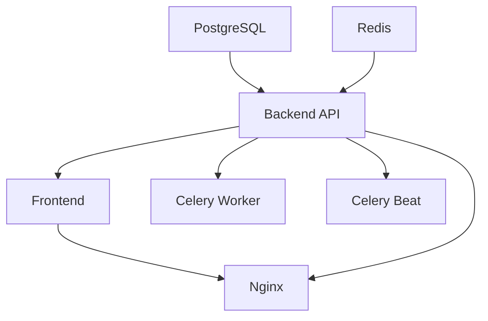

# 🐳 Complete Docker Deployment Guide for Social Media Automation Platform

## 📁 File Structure

```
project-root/
├── docker-compose.yml              # Main orchestration
├── .env.development               # Development environment
├── .env.production                # Production environment  
├── .env.example                   # Template with all variables
│
├── backend/
│   ├── Dockerfile                 # Backend container
│   ├── requirements.txt           # Python dependencies
│   └── app/                       # Your FastAPI application
│
├── frontend/
│   ├── Dockerfile                 # Frontend container
│   ├── package.json               # Node.js dependencies
│   └── src/                       # Your Next.js application
│
├── nginx/
│   ├── nginx.conf                 # Reverse proxy config
│   └── ssl/                       # SSL certificates
│       ├── fullchain.pem          # SSL certificate
│       └── privkey.pem            # SSL private key
│
└── database/
    └── init-db.sql                # Database initialization
```

---

## 🚀 Quick Start Guide

### **1. Environment Setup**

```bash
# Clone your repository
git clone <your-repo-url>
cd social-media-automation

# Copy environment template
cp .env.example .env.development

# Edit environment variables
nano .env.development
```

### **2. Required Environment Variables**

#### **🔑 Critical Security Variables (Must Change!)**
```bash
# Generate secure secrets
openssl rand -hex 32  # For SECRET_KEY
python -c "from cryptography.fernet import Fernet; print(Fernet.generate_key().decode())"  # For ENCRYPTION_KEY

# Database passwords
POSTGRES_PASSWORD=your-secure-db-password-here
REDIS_PASSWORD=your-secure-redis-password-here
```

#### **🤖 AI Service API Keys**
```bash
# Get these from respective services
GEMINI_API_KEY=your-gemini-api-key-here
OPENAI_API_KEY=your-openai-api-key-here
```

#### **📘 Facebook App Credentials**
```bash
# Create Facebook App at developers.facebook.com
FACEBOOK_APP_ID=your-facebook-app-id
FACEBOOK_APP_SECRET=your-facebook-app-secret
```

#### **📧 Email Service (Optional)**
```bash
# For password resets and notifications
EMAIL_SMTP_HOST=smtp.gmail.com
EMAIL_USERNAME=your-email@gmail.com
EMAIL_PASSWORD=your-app-password
```

### **3. Development Deployment**

```bash
# Start all services
docker-compose --env-file .env.development up -d

# View logs
docker-compose logs -f

# Check service health
docker-compose ps
```

### **4. Production Deployment**

```bash
# Copy and configure production environment
cp .env.example .env.production
nano .env.production  # Fill in all production values

# Deploy with production profile
docker-compose --env-file .env.production --profile production up -d

# Run database migrations
docker-compose exec backend alembic upgrade head
```

---

## 🔧 Service Configuration

### **🗄️ Database (PostgreSQL)**
- **Port**: 5432
- **Health Check**: Automatic with 30s intervals
- **Data Persistence**: Named volume `postgres_data`
- **Performance**: Optimized for social media workload

### **🚀 Redis Cache**
- **Port**: 6379
- **Authentication**: Password-protected
- **Data Persistence**: Named volume `redis_data`
- **Usage**: Sessions, caching, Celery broker

### **⚡ FastAPI Backend**
- **Port**: 8000
- **Workers**: 4 (production)
- **Health Check**: `/health` endpoint
- **Features**: Auto-restart, async database, JWT auth

### **🎨 Next.js Frontend**
- **Port**: 3000
- **Build**: Multi-stage optimized
- **Features**: SSR, image optimization, PWA-ready

### **🔄 Background Workers**
- **Celery Worker**: Content generation, API calls
- **Celery Beat**: Scheduled tasks, posting automation
- **Monitoring**: Built-in health checks

### **🔒 Nginx Reverse Proxy**
- **HTTP**: Redirects to HTTPS
- **HTTPS**: SSL termination with security headers
- **Features**: Rate limiting, compression, caching

---

## 📊 Service Dependencies & Startup Order



### **Health Check Dependencies**
```yaml
# Services wait for dependencies to be healthy before starting
backend:
  depends_on:
    db:
      condition: service_healthy
    redis: 
      condition: service_healthy

frontend:
  depends_on:
    backend:
      condition: service_healthy
```

---

## 🔒 Security Configuration

### **🛡️ Network Security**
- **Internal Network**: All services isolated in `social_automation_network`
- **Exposed Ports**: Only 80, 443, 3000, 8000 (configurable)
- **Database**: Not exposed to host (internal only)

### **🔐 Authentication & Authorization**
- **JWT Tokens**: RS256 algorithm with auto-refresh
- **Password Hashing**: bcrypt with salt
- **API Keys**: Encrypted at rest using Fernet
- **Rate Limiting**: Per-IP and per-user limits

### **🔒 SSL/TLS Configuration**
```bash
# Generate SSL certificates (Let's Encrypt recommended)
certbot certonly --standalone -d yourdomain.com -d www.yourdomain.com

# Copy certificates to nginx/ssl/
cp /etc/letsencrypt/live/yourdomain.com/fullchain.pem nginx/ssl/
cp /etc/letsencrypt/live/yourdomain.com/privkey.pem nginx/ssl/
```

### **🛡️ Security Headers**
```nginx
# Implemented in nginx.conf
add_header X-Frame-Options DENY;
add_header X-Content-Type-Options nosniff;
add_header X-XSS-Protection "1; mode=block";
add_header Strict-Transport-Security "max-age=63072000";
add_header Content-Security-Policy "...";
```

---

## 📈 Monitoring & Logging

### **📊 Health Checks**
```bash
# Check all services
curl http://localhost:8000/health    # Backend
curl http://localhost:3000/         # Frontend
docker-compose ps                   # All services

# Database connection
docker-compose exec backend python -c "from app.core.database import test_connection; test_connection()"
```

### **📝 Log Management**
```bash
# View logs
docker-compose logs backend    # Backend logs
docker-compose logs frontend   # Frontend logs
docker-compose logs nginx      # Nginx access/error logs

# Follow logs in real-time
docker-compose logs -f

# Log rotation (automatic in production)
logrotate /etc/logrotate.d/docker-logs
```

### **🔍 Performance Monitoring**
- **Sentry**: Error tracking and performance monitoring
- **Google Analytics**: User behavior and page performance
- **Custom Metrics**: API response times, content generation success rates

---

## 💾 Backup & Recovery

### **🗄️ Database Backup**
```bash
# Manual backup
docker-compose exec db pg_dump -U postgres social_automation > backup_$(date +%Y%m%d_%H%M%S).sql

# Automated backup (configured in .env)
DB_BACKUP_ENABLED=true
DB_BACKUP_SCHEDULE="0 2 * * *"  # Daily at 2 AM
DB_BACKUP_RETENTION_DAYS=30
```

### **💿 Volume Backup**
```bash
# Backup persistent data
docker run --rm -v social_automation_postgres_data:/data -v $(pwd):/backup ubuntu tar czf /backup/postgres_backup.tar.gz /data
docker run --rm -v social_automation_redis_data:/data -v $(pwd):/backup ubuntu tar czf /backup/redis_backup.tar.gz /data
```

### **🔄 Recovery Process**
```bash
# Stop services
docker-compose down

# Restore database
docker-compose up db -d
cat backup_20241222_020000.sql | docker-compose exec -T db psql -U postgres social_automation

# Restore volumes
docker run --rm -v social_automation_postgres_data:/data -v $(pwd):/backup ubuntu tar xzf /backup/postgres_backup.tar.gz -C /

# Restart services
docker-compose up -d
```

---

## 🔧 Maintenance Commands

### **🔄 Update Services**
```bash
# Pull latest images
docker-compose pull

# Rebuild and restart
docker-compose build --no-cache
docker-compose up -d

# Database migrations
docker-compose exec backend alembic upgrade head
```

### **🧹 Cleanup**
```bash
# Remove unused containers and images
docker system prune -f

# Remove old database data (use with caution)
docker-compose exec backend python -c "from app.models.models import cleanup_old_data; cleanup_old_data()"

# Reset development environment
docker-compose down -v  # WARNING: Deletes all data
docker-compose up -d
```

### **📊 Performance Optimization**
```bash
# Database optimization
docker-compose exec db psql -U postgres social_automation -c "VACUUM ANALYZE;"

# Container resource monitoring  
docker stats

# Disk usage
docker system df
```

---

## 🚨 Troubleshooting Guide

### **❌ Common Issues**

#### **Database Connection Issues**
```bash
# Check database logs
docker-compose logs db

# Test connection
docker-compose exec backend python -c "import asyncpg; print('DB accessible')"

# Reset database
docker-compose down db
docker volume rm social_automation_postgres_data
docker-compose up db -d
```

#### **Backend API Not Responding**
```bash
# Check backend logs
docker-compose logs backend

# Restart backend
docker-compose restart backend

# Check dependencies
docker-compose exec backend pip list
```

#### **Frontend Build Failures**
```bash
# Check build logs
docker-compose logs frontend

# Rebuild with no cache
docker-compose build --no-cache frontend

# Check environment variables
docker-compose exec frontend env | grep NEXT_PUBLIC
```

#### **SSL Certificate Issues**
```bash
# Check certificate validity
openssl x509 -in nginx/ssl/fullchain.pem -text -noout

# Renew Let's Encrypt certificate
certbot renew --dry-run

# Test SSL configuration
nginx -t
```

### **🔍 Debug Mode**
```bash
# Enable debug logging
export DEBUG=true
export LOG_LEVEL=DEBUG

# Run with debug
docker-compose --env-file .env.development up
```

---

## 🎯 Production Checklist

### **🔒 Security Checklist**
- [ ] Change all default passwords and secrets
- [ ] Configure SSL certificates
- [ ] Enable rate limiting
- [ ] Set up firewall rules
- [ ] Configure backup strategy
- [ ] Enable monitoring and alerting
- [ ] Review CORS settings
- [ ] Validate environment variables

### **⚡ Performance Checklist**
- [ ] Configure database connection pooling
- [ ] Enable Redis caching
- [ ] Set up CDN for static assets
- [ ] Configure log rotation
- [ ] Optimize Docker images
- [ ] Set resource limits
- [ ] Configure auto-scaling (if using cloud)

### **📊 Monitoring Checklist**  
- [ ] Set up Sentry error tracking
- [ ] Configure Google Analytics
- [ ] Enable application metrics
- [ ] Set up log aggregation
- [ ] Configure alerting rules
- [ ] Test backup and recovery
- [ ] Set up uptime monitoring

---

## 🌐 Production Deployment Examples

### **🔥 AWS/Cloud Deployment**
```bash
# Using docker-compose on cloud instance
ssh your-server
git clone <repo>
cd social-media-automation

# Configure environment
cp .env.example .env.production
nano .env.production

# Deploy with production profile
docker-compose --env-file .env.production --profile production up -d

# Configure auto-start
sudo systemctl enable docker
echo "docker-compose --env-file .env.production --profile production up -d" > /etc/rc.local
```

### **🚢 Kubernetes Migration Path**
```bash
# Generate Kubernetes manifests from docker-compose
kompose convert -f docker-compose.yml

# Apply to cluster
kubectl apply -f .
```

---

## 📞 Support & Resources

### **📚 Documentation Links**
- [Docker Compose Reference](https://docs.docker.com/compose/)
- [FastAPI Documentation](https://fastapi.tiangolo.com/)
- [Next.js Deployment](https://nextjs.org/docs/deployment)
- [PostgreSQL Performance](https://www.postgresql.org/docs/current/performance-tips.html)

### **🆘 Getting Help**
1. Check service logs: `docker-compose logs <service>`
2. Verify environment variables are set correctly
3. Ensure all required API keys are configured
4. Check network connectivity between services
5. Review the troubleshooting guide above

---

## 🎉 Success Metrics

### **✅ Deployment Success Indicators**
- All services show `healthy` status
- Frontend accessible at https://yourdomain.com
- Backend API accessible at https://api.yourdomain.com
- Database migrations completed successfully
- SSL certificate valid and working
- Background tasks processing correctly

### **📊 Performance Benchmarks**
- **API Response Time**: < 200ms average
- **Page Load Time**: < 3 seconds
- **Database Query Time**: < 100ms average
- **Content Generation**: < 30 seconds
- **Uptime**: > 99.9%

---

**🚀 Your social media automation platform is now ready for production deployment!**

**Need help? Check the troubleshooting section or review the logs for detailed error information.**
